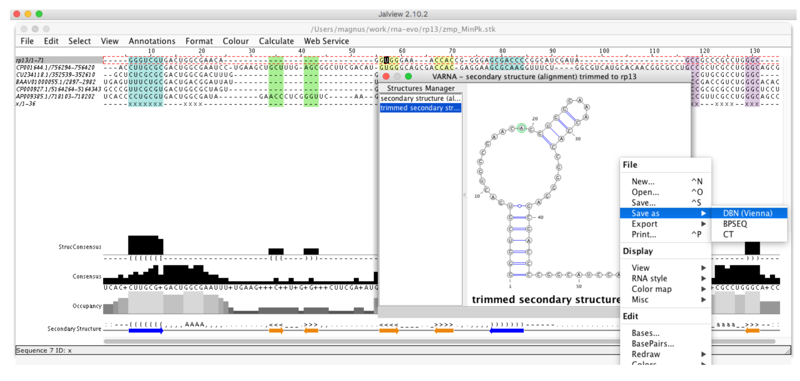
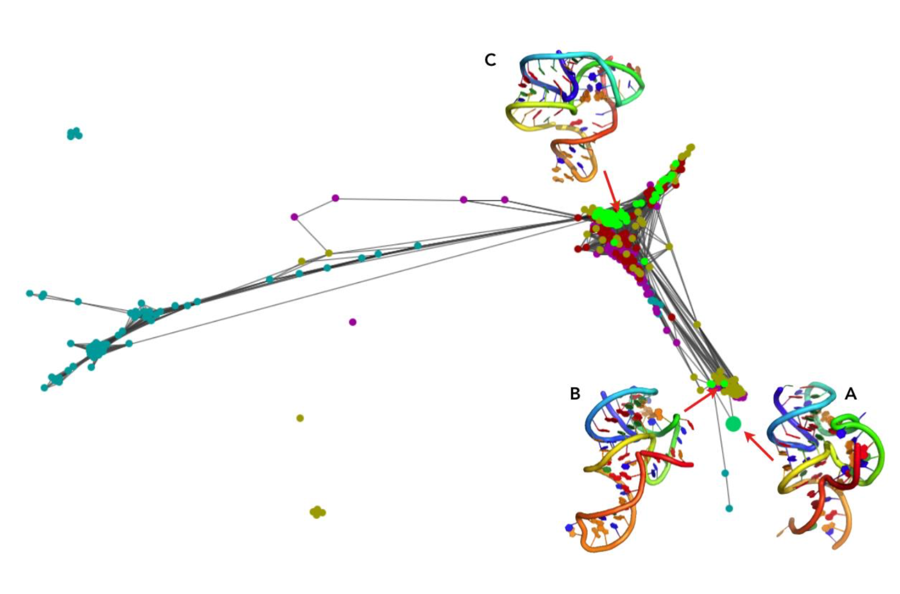

# Get Started

(All the code can be executed in the folder evoClustRNA/test_data/rp13 of this repository)

Prepare a multiple sequence alignment (MSA)
-------------------------------------------

For the target sequence, the user needs to prepare an alignment or download it from the from the Rfam database. The sequence similarity should be reduced, using JalView to keep only diverse representatives. In theory, all sequences could be folded but because of the computational costs of simulations (6-10h per sequence for 80 CPUs, using either SimRNAweb or Rosetta FARFAR), we decided to fold only 4 the shortest sequences from the MSA. Once the final set of homologs to be folded was selected, the positions common to all sequences selected were determined.


Figure 1. **The alignment preparation.** The conserved residues are marked with "x" in the pseudo-sequence "x".
The marked as the conserved residues columns can be inspected in an arc diagrams of RNA secondary structures as the pink line (at the very bottom)


Figure 2. **Obtain sequence and secondary structure**. Each sequence and associated secondary structure was "Saved as" to a Fasta file and used at the next stage of modeling with the use of the Jalview program.

RNA 3D structure prediction to generate initial models
-------------------------------------------

For each sequence chosen for folding, the user must prepare an input for RNA 3D structure prediction method. Two methods were used in this study: SimRNA and Rosetta. For Rosetta, a total of 10,000 decoys were generated for the target sequence and each homologous sequence using the Rosetta FARFAR protocol. For SimRNA prediction, SimRNAweb (https://genesilico.pl/SimRNAweb/) server was used using the default parameters.

To start with the EvoClustRNA protocol, we suggest using SimRNAweb first. The results are comparable to Rosetta, but the server is much easier to use for beginners.

At the end of modeling, top100 (or top200) models have to be extracted and copied into the ```structures``` folder.

Run EvoClustRNA clustering procedure (including extraction of conserved motifs)
-------------------------------------------------------------------------------------

Run ```evoClustRNA.py``` on an alignment (-a) and a folder with structures (-i) using mapping (-m) and flat directory structure:

    [mm] evox$ git:(master) ✗ evoClustRNA.py -a ../rp13finalX_noSSperSeq_ref.sto -i structures -m ../mapping_ref.txt -f
     \_ evoClustRNA  Namespace(flat_dir=True, inf=False, input_dir='structures', mapping_fn='../mapping_ref.txt', matrix_fn='', output_dir='out', rna_alignment_fn='../rp13finalX_noSSperSeq_ref.sto', save=False, verbose=False)
    rp13finalX_noSSperSeq_ref_mapping_refX.matrix
     # of rnastruc: 6
     rnastruc: ['rp13:tar_', 'rp13:solution', 'cp0016:zcp', 'nc9445:znc', 'nc3295:zc3', 'nzaaox:zza']
      rp13 <-> tar_
       cutting out fragments ...
       analyzing... structures/*tar_*.pdb
       # of structures 200
      rp13 <-> solution
       cutting out fragments ...
       analyzing... structures/*solution*.pdb
       # of structures 1
      cp0016 <-> zcp
       cutting out fragments ...
       analyzing... structures/*zcp*.pdb
       # of structures 200
      nc9445 <-> znc
       cutting out fragments ...
       analyzing... structures/*znc*.pdb
       # of structures 200
      nc3295 <-> zc3
       cutting out fragments ...
       analyzing... structures/*zc3*.pdb
       # of structures 200
      nzaaox <-> zza
       cutting out fragments ...
       analyzing... structures/*zza*.pdb
       # of structures 200
     # of models: 1001
    matrix was created!  rp13finalX_noSSperSeq_ref_mapping_refX.matrix
    evoClustRNA.py -a ../rp13finalX_noSSperSeq_ref.sto -i structures -m ../mapping_ref.txt -f

`rp13finalX_noSSperSeq_ref_mapping_refX.matrix` is the matrix with all-vs-all RMSDs for all conserved motifs.

Now it's time to cluster the matrix:

    evoClust_autoclustix.py  rp13finalX_noSSperSeq_ref_mapping_refX.matrix
    # of struc 1001
    evoClust_clustix.py rp13finalX_noSSperSeq_ref_mapping_refX.matrix -c 0
    n:  0
    rm rp13finalX_noSSperSeq_ref_mapping_refX*cf0*.out # auto-removal
    evoClust_clustix.py rp13finalX_noSSperSeq_ref_mapping_refX.matrix -c 0.5
    n:  1
    (....)
    rm rp13finalX_noSSperSeq_ref_mapping_refX*cf8.5*.out # auto-removal
    evoClust_clustix.py rp13finalX_noSSperSeq_ref_mapping_refX.matrix -c 9.0
    n:  166

When the clustering is done, the best clusters can be obtained and copied to two folders for futher analysis: `reps` and `reps_ns`.

Copy the best cluster medoids from `structures` to reps

    [mm] evox$ git:(master) ✗ evoClust_get_models.py -i structures/ *.out -u
    evoClust_get_models.py
    --------------------------------------------------------------------------------
    1_tar_min.out.1.pdb
    2_zcp_min.out.8.pdb
    3_tar_min.out.66.pdb
    4_tar_min.out.98.pdb
    5_tar_min.out.25.pdb
    = structures == out/structures/<files>===================
    cp -v structures//tar_min.out.1.pdb reps/c1_tar_min.out.1.pdb
    structures//tar_min.out.1.pdb -> reps/c1_tar_min.out.1.pdb
    cp -v structures//zcp_min.out.8.pdb reps/c2_zcp_min.out.8.pdb
    structures//zcp_min.out.8.pdb -> reps/c2_zcp_min.out.8.pdb
    cp -v structures//tar_min.out.66.pdb reps/c3_tar_min.out.66.pdb
    structures//tar_min.out.66.pdb -> reps/c3_tar_min.out.66.pdb
    cp -v structures//tar_min.out.98.pdb reps/c4_tar_min.out.98.pdb
    structures//tar_min.out.98.pdb -> reps/c4_tar_min.out.98.pdb
    cp -v structures//tar_min.out.25.pdb reps/c5_tar_min.out.25.pdb
    structures//tar_min.out.25.pdb -> reps/c5_tar_min.out.25.pdb

Copy the best cluster medoids from `structures` to `reps_ns` (this is where only models for the target sequences are stored, so no models of homologs):

    [mm] evox$ git:(master) ✗ evoClust_get_models.py -i structures/ *.out -n tar -u
    evoClust_get_models.py
    --------------------------------------------------------------------------------
    ['tar_min.out.1.pdb', '', 'tar_min.out.66.pdb', 'tar_min.out.98.pdb', 'tar_min.out.25.pdb']
    1_tar_min.out.1.pdb
    2_
    3_tar_min.out.66.pdb
    4_tar_min.out.98.pdb
    5_tar_min.out.25.pdb
    = structures == out/structures/<files>===================
    cp -v structures//tar_min.out.1.pdb reps_ns/c1_tar_min.out.1.pdb
    structures//tar_min.out.1.pdb -> reps_ns/c1_tar_min.out.1.pdb
    cp -v structures// reps_ns/c2_
    cp: structures// is a directory (not copied).
    cp -v structures//tar_min.out.66.pdb reps_ns/c3_tar_min.out.66.pdb
    structures//tar_min.out.66.pdb -> reps_ns/c3_tar_min.out.66.pdb
    cp -v structures//tar_min.out.98.pdb reps_ns/c4_tar_min.out.98.pdb
    structures//tar_min.out.98.pdb -> reps_ns/c4_tar_min.out.98.pdb
    cp -v structures//tar_min.out.25.pdb reps_ns/c5_tar_min.out.25.pdb
    structures//tar_min.out.25.pdb -> reps_ns/c5_tar_min.out.25.pdb

## Compare to the reference structure

OK, so now we have two folders with models that we can compare to the reference structure.

Various methods can be used to do that. For `reps_ns` (so the models for the reference sequence) you can use full atom RMSD:

    [mm] evox$ git:(master) ✗ rna_calc_rmsd.py -t ..//*ref.pdb reps_ns/*.pdb
    method: all-atom-built-in
    # of models: 4
    c1_tar_min.out.1.pdb 6.34 1295
    c3_tar_min.out.66.pdb 11.6 1295
    c4_tar_min.out.98.pdb 15.1 1295
    c5_tar_min.out.25.pdb 14.34 1295
    # of atoms used: 1295
    csv was created!  rmsds.csv

core RMSDs based on the alignment:

    evoClust_calc_rmsd.py -a ..//*ref.sto -t ..//*ref.pdb -n rp13 -m ..//*mapping*ref.txt -o rmsd_motif.csv reps/*.pdb
    Fri Jun 21 17:01:33 2019
    Namespace(debug=False, dont_ignore_clusters=False, files=['reps/c1_tar_min.out.1.pdb', 'reps/c2_zcp_min.out.8.pdb', 'reps/c3_tar_min.out.66.pdb', 'reps/c4_tar_min.out.98.pdb', 'reps/c5_tar_min.out.25.pdb'], group_name='', mapping_fn='..//mapping_ref.txt', output_fn='rmsd_motif.csv', rna_alignment_fn='..//rp13finalX_noSSperSeq_ref.sto', target='..//target_13_solution_0_renumber_puzzle_ref.pdb', target_name='rp13')
    target: ..//target_13_solution_0_renumber_puzzle_ref.pdb
     # of rnastruc : 6
     rnastruc: ['rp13:tar_', 'rp13:solution', 'cp0016:zcp', 'nc9445:znc', 'nc3295:zc3', 'nzaaox:zza']
     WARNING: if any of your PDB file is missing, check mapping!
                                             target                  model   rmsd group_name
    0  target_13_solution_0_renumber_puzzle_ref.pdb   c1_tar_min.out.1.pdb   4.41
    1  target_13_solution_0_renumber_puzzle_ref.pdb   c2_zcp_min.out.8.pdb  16.08
    2  target_13_solution_0_renumber_puzzle_ref.pdb  c3_tar_min.out.66.pdb  10.32
    3  target_13_solution_0_renumber_puzzle_ref.pdb  c4_tar_min.out.98.pdb  15.50
    4  target_13_solution_0_renumber_puzzle_ref.pdb  c5_tar_min.out.25.pdb  15.24

or INFs:

    [mm] evox$ git:(master) ✗ rna_calc_inf.py -f -t ..//*ref.pdb reps_ns/*.pdb
    100% (4 of 4) |###########################################################################################################################################################################| Elapsed Time: 0:00:16 ETA:  00:00:00csv was created!  inf.csv
    [mm] evox$ git:(master) ✗ csv inf.csv
    target                                              fn                           inf_all  inf_stack  inf_WC  inf_nWC  sns_WC  ppv_WC  sns_nWC  ppv_nWC
    target_13_solution_0_renumber_puzzle_ref.pdb.outCR  c4_tar_min.out.98.pdb.outCR  0.453    0.000      0.923   0.507    0.947   0.900   0.429    0.600
    target_13_solution_0_renumber_puzzle_ref.pdb.outCR  c3_tar_min.out.66.pdb.outCR  0.437    0.000      0.947   0.218    0.947   0.947   0.143    0.333
    target_13_solution_0_renumber_puzzle_ref.pdb.outCR  c1_tar_min.out.1.pdb.outCR   0.431    0.000      0.973   0.286    0.947   1.000   0.286    0.286
    target_13_solution_0_renumber_puzzle_ref.pdb.outCR  c5_tar_min.out.25.pdb.outCR  0.483    0.129      0.947   0.535    0.947   0.947   0.286    1.000

## Clanstix
The results can be also viewed with Clans, shown in the Figure 3 & 4.

In this clustering visualization, 100 models of five homologs are shown (each homolog uniquely colored, models of the target sequence are colored in lime). Models with a pairwise distance in terms of RMSDs lower than 6 Å are connected. The native structure was added to this clustering to see where it would be mapped. Interestingly, the native structure was mapped to the small cluster. In this cluster, there are three models for the target sequence. The model the closest to this the cluster center (Fig. 3B) achieved an RMSD of 6.98 Å to the native structure. This clustering visualization showed that there were models generated with the correct fold, but none of them were selected as the final prediction. The final prediction was the center of the biggest cluster (Fig. 3C).


Figure 3. **Pistol Ribozyme (RNA-Puzzle 17)** Clustering visualized with Clans (A) the native structure, (B) the model with the close fold to the native, detected in a small cluster, (C) the biggest cluster with the model that was returned as the final prediction.

An analogous analysis was performed the results of clustering of EvoClustRNA|SimRNAweb run for the TPP riboswitch. Models with a pairwise distance in terms of RMSDs lower than 9 Å are connected. Interestingly, the native structure (Fig. 4A, big dot) was mapped to a cluster of models of one of the homologs (Fig. 4, blue). The center of this cluster (Fig. 4B) achieved an RMSD (of helical, shared fragments) of 9 Å to the native structure. In this cluster, there were not models for the target sequence. Since SimRNAweb was not able to detect non-canonical interactions, most of the structures were in “open” conformation and clustered far from the native structure. The final prediction was (Fig. 4C) achieved an RMSD of 24.08 Å with respect to the native.


Figure 4: Clustering visualized with Clans (A) the native structure, (B) the model with the close fold to the native (C) the biggest cluster with the model that was returned as the final prediction.

Learn more about Clanstix https://rna-tools.readthedocs.io/en/latest/tools.html#module-rna_tools.tools.clanstix.rna_clanstix

Figure 4: **Clustering visualized with Clans for TPP riboswitch** (A) the native structure, (B) the model with the close fold to the native (C) the biggest cluster with the model that was returned as the final prediction.
